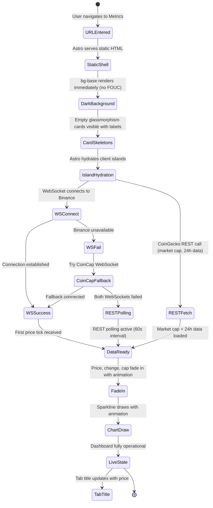
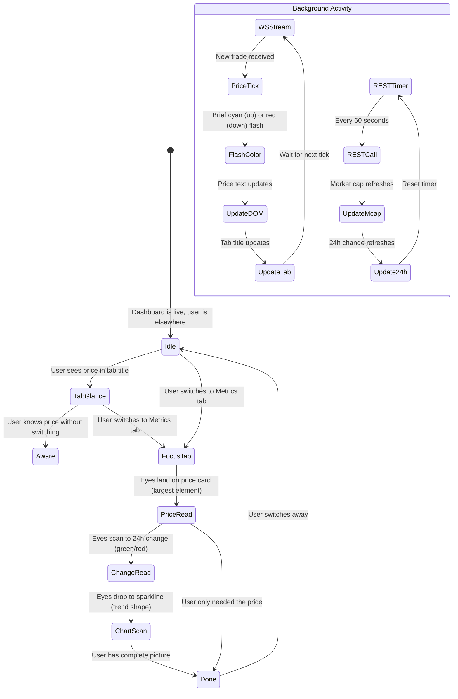
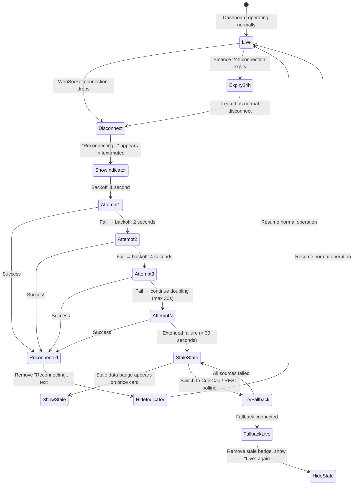
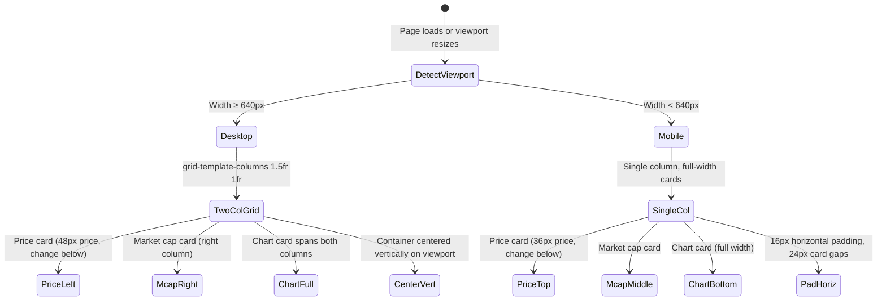

# UX Design Specification - Metrics

**Author:** Dmytro
**Date:** 2026-03-25

---

## Executive Summary

### Project Vision

Single-page, real-time Bitcoin dashboard designed around three UX pillars: speed (information available in < 1 second of glancing), aesthetics (dark crypto visual identity that feels premium and alive), and focus (one asset, one page, zero cognitive overhead). The product competes on depth of simplicity — every design decision serves the "open tab, know the price, move on" experience.

### Target Users

Primary user: Dmytro, a developer who uses Metrics as a pinned browser tab for daily BTC price checking. Desktop-first with occasional mobile glances. Expects zero configuration, zero onboarding, and instant information delivery. Tech-savvy but values beauty and polish — the dashboard should feel crafted, not cobbled.

### Key Design Challenges

- **Information hierarchy:** Four data elements (price, 24h change, market cap, chart) on a single screen require clear visual priority. Live price dominates; supporting data is secondary but instantly parseable.
- **Dark theme readability:** Near-black backgrounds (#0a0a0f) with neon accents demand careful contrast management. Price figures must be high-contrast without causing eye strain during extended pinned-tab viewing.
- **State transitions:** WebSocket connection states (connecting, live, reconnecting, stale) must be communicated subtly without disrupting the primary price display. No layout shift during any state change.

### Design Opportunities

- **Sub-second glanceability:** Nail the information hierarchy so the price registers in peripheral vision. Tab title with live price extends this to no-focus-needed awareness.
- **Motion as polish:** Entry animations, price tick effects, and chart drawing create a sense of liveness and premium feel. Motion communicates "this is real-time" without needing a label.
- **Dark crypto aesthetic as identity:** Glassmorphism cards, neon accents, and monospaced price typography create a distinctive visual brand that's portfolio-worthy and instantly recognizable.

## Core User Experience

### Defining Experience

The core interaction is **the glance** — a sub-second visual scan that delivers complete BTC awareness. No clicks, no scrolling, no reading. The price registers in peripheral vision from a pinned tab; supporting data (change, cap, trend) is absorbed in a single focused look. The product's entire value is delivered passively. The user invests zero effort and receives complete information.

### Platform Strategy

- **Primary platform:** Desktop web browser (Chrome, Firefox, Safari, Edge) as a pinned tab
- **Secondary platform:** Mobile web browser for on-the-go checks
- **Input model:** Read-only — no mouse interaction required for core experience. Hover tooltips on chart are the only interactive element.
- **Offline consideration:** Not applicable — the product's value is real-time data. When offline, display last known data with stale indicator.
- **Tab title:** Leveraged as a zero-focus information channel — price visible without switching to the tab

### Effortless Interactions

Everything that should happen without user intervention:

- **Price updates:** WebSocket stream delivers ticks automatically — no refresh, no polling button
- **Data refresh:** Market cap and 24h stats refresh via REST every 60s — invisible to user
- **Reconnection:** WebSocket drops are handled silently with exponential backoff. User sees a subtle indicator only if reconnection takes more than a few seconds.
- **Theme rendering:** Dark theme is the default and only theme — renders immediately with no flash of white
- **Initial hydration:** Static shell appears instantly; data fades in smoothly as WebSocket connects. No loading spinners, no skeleton screens.
- **Responsive adaptation:** Layout shifts from horizontal (desktop) to stacked (mobile) based on viewport — no user toggle

### Critical Success Moments

1. **The First Load (make-or-break):** Dark background fills the screen. Static shell renders. Price fades in with animation. Chart draws itself. Under 1.5 seconds from URL to live data. If this moment feels slow, broken, or visually jarring — the product fails its promise.
2. **The Daily Glance (retention):** User switches to pinned tab and price is already there, already current, already beautiful. This moment must be 100% reliable. Any stale data, broken layout, or disconnection erodes trust.
3. **The Reconnect (resilience):** WiFi drops, WebSocket disconnects. The transition from "live" to "reconnecting" to "live again" must be smooth and nearly invisible. The user should barely notice it happened.

### Experience Principles

1. **Passive over active:** The user should never have to do anything. Information is delivered, not retrieved.
2. **Instant over progressive:** Show the answer immediately. No loading states, no progressive disclosure, no "please wait." Static shell + data fade-in is the only acceptable load pattern.
3. **Subtle over loud:** State changes (reconnecting, stale data) are communicated through understated visual cues — never modals, toasts, or attention-grabbing alerts. The price display is always the loudest element.
4. **Alive over static:** Gentle motion (price ticks, chart animation, fade-ins) communicates that the data is live and the system is working. Stillness should feel intentional, not broken.

## Desired Emotional Response

### Primary Emotional Goals

- **Calm confidence:** "I know the price." Zero anxiety, zero effort. The information is just there, reliable and current. The feeling of a tool that works so well it disappears.
- **Pride of ownership:** "I built this, it's beautiful, it's mine." The dashboard isn't just functional — it's a personal artifact. The visual polish reflects the care that went into building it. Every glance reinforces "I made something good."
- **Quiet control:** The sense of having exactly the information you need, presented exactly how you want it. No one else's ads, no one else's layout decisions, no one else's priorities. This is your window into BTC.

### Emotional Journey Mapping

| Moment | Desired Emotion | Design Lever |
|---|---|---|
| First load | Delight + pride — "This looks incredible" | Dark theme fills screen, data animates in smoothly, immediate visual impact |
| Daily glance | Calm confidence — "I know" | Price is instantly visible, data is current, no surprises |
| Price moving fast | Engaged awareness — "I can see it happening" | Live ticking price creates a sense of connection to the market |
| WiFi drops | Unbothered trust — "It'll handle it" | Subtle reconnecting indicator, no alarm, no disruption |
| Showing someone | Pride — "Look what I built" | The aesthetic sells itself. Glassmorphism, neon, monospace — it looks impressive |
| Mobile check | Same confidence, smaller screen — "Still works perfectly" | Responsive layout preserves the feeling, not just the function |

### Micro-Emotions

**Cultivate:**
- **Confidence** over confusion — the data hierarchy is instantly clear, never ambiguous
- **Trust** over skepticism — live indicators and smooth reconnection prove the data is real and current
- **Delight** over mere satisfaction — the animations, typography, and visual details reward attention
- **Ownership** over generic utility — this feels personal, not like a commodity widget

**Prevent:**
- **Anxiety** — never show alarming error states. Connection issues are handled quietly.
- **Doubt** — never leave the user wondering if the price is current. Stale data is explicitly marked.
- **Boredom** — the subtle motion (price ticks, chart updates) keeps the display feeling alive without being distracting

### Design Implications

- **Pride of craft → Visual polish is non-negotiable.** Every pixel matters. Glassmorphism blur must be smooth, typography spacing must be precise, animations must be 60 FPS. This is a portfolio piece — it should look like one.
- **Calm confidence → Information hierarchy is the #1 UX priority.** The price must be the loudest element by far. Supporting data is clearly secondary. No visual competition.
- **Trust → State communication must be honest but calm.** "Reconnecting..." in muted text — never a red error banner. Stale data badge — never a blocking modal. The system tells the truth without raising its voice.
- **Ownership → No generic UI patterns.** The dark crypto aesthetic is the product's personality. It should feel bespoke, not template-driven. Custom color palette, intentional typography pairing, considered spacing.

### Emotional Design Principles

1. **Polish earns pride.** Every detail that's refined — a smooth animation, a perfect font size, a considered color choice — compounds into the feeling of "I made something good." Cut no corners on visual quality.
2. **Reliability earns trust.** The data is always there, always current, always correct. When it's not, the system says so honestly and fixes itself quietly. Trust is built through consistent, boring reliability.
3. **Restraint earns calm.** The product never demands attention. It never interrupts. It never shows more than needed. Calm comes from the absence of noise, not the presence of calming elements.
4. **Personality earns ownership.** The neon-on-dark aesthetic, the monospaced prices, the glassmorphism cards — these aren't just style choices, they're identity. The product should feel like *yours*, not like a generic dashboard with a dark mode toggle.

## UX Pattern Analysis & Inspiration

### Inspiring Products Analysis

**1. TradingView (chart widget, not the full platform)**

What they nail: The lightweight-charts library (which we're using) comes from TradingView. Their embedded chart widgets are a masterclass in information density on dark backgrounds. Price is always the hero element. The chart feels alive — crosshair tracking, smooth transitions between timeframes, and a color system that makes green/red changes instantly parseable. Their dark theme is the industry standard that every crypto dashboard references.

**Lesson for Metrics:** The chart interaction model (hover crosshair with price/time tooltip) is proven and familiar. Don't reinvent it — adopt it directly from lightweight-charts defaults.

**2. Is It Down Right Now (isitdownrightnow.com) / Downdetector**

What they nail: Single-purpose, single-question tools. You go there with one question ("Is X down?"), you get the answer immediately, you leave. Zero navigation, zero onboarding, zero accounts. The UX is the answer. This is the closest interaction model to what Metrics does — except Metrics does it with visual polish.

**Lesson for Metrics:** The "answer is the page" pattern. No hero section, no welcome message, no instructions. The data IS the interface. Load → answer → done.

**3. Stripe Dashboard (dark mode)**

What they nail: Premium dark UI with clear information hierarchy. Numbers are the loudest elements — large, monospaced, high-contrast white on near-black. Supporting text is muted gray. Cards with subtle borders and shadows create visual grouping without cluttering. State indicators (live, test mode) are minimal colored badges. The whole thing feels expensive and considered.

**Lesson for Metrics:** The hierarchy pattern — large monospaced numbers dominate, labels are quiet, cards group without competing. And the way Stripe handles state badges (small, colored, unobtrusive) maps directly to our reconnecting/stale data indicators.

### Transferable UX Patterns

**Information Hierarchy:**
- Large monospaced price as the dominant visual element (TradingView, Stripe)
- Muted secondary labels that don't compete with data (Stripe)
- Color-coded directional indicators — green up, red down — no labels needed (TradingView)

**Data Liveness:**
- Price tick animation on update — brief color flash or number transition (TradingView)
- Chart crosshair with tooltip on hover for detail-on-demand (TradingView lightweight-charts)
- No explicit "last updated" timestamp for live data — liveness is communicated through motion, not text

**Single-Purpose Layout:**
- Data IS the interface — no navigation, no sidebar, no header chrome (Is It Down)
- Answer visible within 0 scrolls — everything above the fold on all devices (Is It Down)
- The page is the product — no routes, no states, no modes

**Dark Theme Execution:**
- Near-black backgrounds with subtle card elevation via border or shadow, not background contrast (Stripe)
- Glassmorphism for primary data cards, solid backgrounds for secondary elements
- Neon accents used sparingly — for interactive elements and status indicators, not decoration

### Anti-Patterns to Avoid

- **CoinGecko/CoinMarketCap:** Dozens of coins, ads, nav bars, footer links, trending lists, news feeds. The opposite of focus. Everything competes for attention.
- **Loading spinners:** Products that show a spinner before data appears create anxiety. Metrics should show the static shell immediately and fade data in — never a blank screen with a spinner.
- **"Last updated: 3 seconds ago" timestamps:** These create doubt ("is 3 seconds old?"). Live motion (ticking price) communicates freshness better than any timestamp.
- **Toast notifications for connection events:** "Connected!" / "Disconnected!" toasts are noisy and interruptive. State should be communicated through subtle, persistent indicators — not ephemeral popups.
- **Skeleton screens for simple data:** Skeleton loaders are for complex layouts with unknown content. For four known data elements, reserved space with a quick fade-in is cleaner and faster-feeling.

### Design Inspiration Strategy

**Adopt directly:**
- lightweight-charts hover crosshair with price/time tooltip (proven, familiar)
- Large monospaced price as visual anchor (TradingView/Stripe pattern)
- Green/red color coding for price direction (universal convention)
- "Answer is the page" single-screen layout (Is It Down pattern)

**Adapt for Metrics:**
- Stripe's card hierarchy → glassmorphism cards with neon accent borders instead of subtle gray borders
- Stripe's state badges → minimal connection status indicator (colored dot + text, not a banner)
- TradingView's price tick animation → brief color flash on price change (cyan flash up, red flash down) that fades to white

**Avoid:**
- Any navigation elements, sidebars, or header chrome
- Loading spinners or skeleton screens
- Toast notifications for system events
- Explicit "last updated" timestamps for live data
- Any multi-page patterns or routing

## Design System Foundation

### Design System Choice

**Tailwind CSS utility framework** with a custom design token layer. No component library — the product has only 4-5 visual elements (price display, change indicator, market cap, chart card, status indicator), making a full component library unnecessary overhead. Tailwind provides the utility backbone; custom tokens define the crypto aesthetic.

### Rationale for Selection

- **Visual uniqueness required:** The dark crypto aesthetic (glassmorphism, neon accents, monospace prices) is too specific for any off-the-shelf component library. Custom styling is mandatory.
- **Minimal component surface:** A single page with ~5 visual elements doesn't justify the bundle cost or learning curve of MUI, Chakra, or Ant Design.
- **Already specified in PRD:** Tailwind CSS was chosen during product planning — this decision maintains consistency.
- **Solo developer efficiency:** Tailwind's utility classes allow rapid iteration without context-switching between CSS files and components. Custom tokens ensure consistency without a design system overhead.
- **Bundle performance:** Tailwind's purge removes unused styles. No component library JS to ship. Aligns with the < 100KB gzipped JS budget.

### Implementation Approach

**Tailwind Config as Design System:**

The `tailwind.config.js` file serves as the single source of truth for all design tokens, using `theme.extend` (not override) to preserve Tailwind defaults:

- **Colors (semantic naming):** `accent-primary` (cyan), `accent-secondary` (purple), `accent-tertiary` (green), `price-up`, `price-down`, `bg-base`, `bg-card`, `text-primary`, `text-muted`, `text-label` — never raw color names like `cyan-400`
- **Typography:** JetBrains Mono for price figures, Inter for labels — configured as named font families (`font-price`, `font-label`) with appropriate size/weight scales
- **Effects:** Glassmorphism utilities (backdrop-blur, border opacity), glow effects for neon accents, transition presets for animations
- **Spacing:** Custom spacing scale if Tailwind defaults don't match the desired density

**CSS Custom Properties from Day One:**

CSS variables alongside Tailwind tokens for any value that animates or transitions at runtime:
- `--price-flash-up` / `--price-flash-down` — for price tick color flash animations (can't transition between Tailwind utility classes)
- `--connection-status` — for status indicator color transitions
- Defined in `:root` and synchronized with Tailwind token values

**Shared Constants File:**

A `theme-constants.ts` file that exports color values used by both Tailwind config and lightweight-charts API config. The chart library applies its own inline styles (line color, crosshair, grid lines) via its JS API — these must mirror the Tailwind tokens but can't reference them directly. A shared constants file prevents drift.

### Customization Strategy

- **Semantic token naming** throughout — tokens communicate intent (`accent-primary`, `text-muted`) not implementation (`cyan-400`, `gray-500`). If the accent color changes from cyan to green, no token names read wrong.
- **Reusable utility compositions** via `@apply` for 3 repeated patterns maximum: `.card-glass` (glassmorphism card), `.price-text` (large monospaced price styling), `.status-badge` (connection state indicator). No more — overusing `@apply` defeats utility-first and complicates debugging.
- **Astro scoped styles** for animation keyframes co-located with each island component, while Tailwind handles layout and token-based styling
- **No component abstraction layer** for v1 — with only ~5 visual elements, inline Tailwind classes are sufficient. Component extraction happens in Phase 3 (reusable library) if needed.

## Defining Experience

### The Core Interaction

**"Glance at a tab and know the Bitcoin price."**

The defining experience is passive information absorption. The user does nothing — the product delivers. Like a wall clock on the wall: you don't operate it, you don't configure it, you just look at it and you know. If Metrics nails this one interaction — instant, reliable, beautiful awareness — everything else follows.

### User Mental Model

**Current mental model (what Metrics replaces):**
- "I need to check the Bitcoin price" → open Google/CoinGecko → scan through noise → find the number → close or navigate away
- Active retrieval: go somewhere, look something up, extract the answer, leave

**New mental model (what Metrics creates):**
- "I wonder what Bitcoin is at" → glance at pinned tab → know
- Passive awareness: the answer is already there, always current, always visible
- Analogous to a wall clock — you don't "use" it, you just look at it

**Mental model shift:** From "go find information" to "information is already here." This is the core UX insight. The product doesn't feel like a tool you operate — it feels like a window you look through.

### Success Criteria for Core Experience

- **Sub-second comprehension:** The price registers within one visual scan — no reading, no parsing, no searching the page
- **Zero-action awareness:** The user performs no clicks, no scrolls, no hovers to get the primary information
- **Persistent reliability:** Every time the user glances at the tab, the data is there and current. 100% consistency builds the "wall clock" trust
- **Tab-level awareness:** The browser tab title shows the price — awareness without even switching to the tab
- **Beautiful by default:** The visual quality reinforces "I built something good" on every glance

### Pattern Analysis

**Established patterns only — no novel interaction design required.**

All interaction patterns in Metrics are proven and familiar:
- Real-time dashboard display (TradingView, Stripe, any analytics tool)
- Sparkline chart with hover tooltip (universal data visualization pattern)
- Color-coded up/down indicators (universal financial convention)
- Connection status indicators (any real-time app)
- Dark theme dashboard (industry standard for financial/crypto tools)

**The innovation is curation, not interaction.** Metrics takes established patterns and applies radical subtraction — removing everything that isn't the answer. No new patterns to teach, no learning curve, no onboarding.

### Experience Mechanics

**1. Initiation:**
- User opens browser → pinned tab is already there (no action required)
- OR user navigates to URL → page loads in < 1.5 seconds
- No splash screen, no welcome, no onboarding — the data IS the landing page

**2. Interaction (passive):**
- **Primary:** Eyes land on the page → large monospaced price is immediately visible → comprehension complete
- **Secondary (optional):** Eyes scan downward → 24h change, market cap, sparkline chart absorbed in a single focused look
- **Detail-on-demand:** Hover over chart → crosshair with price/time tooltip for specific data points (only interactive element)

**3. Feedback:**
- **Liveness:** Price ticks with brief color flash (cyan up, red down) — confirms data is live without any label
- **Direction:** Green/red color on 24h change — instant positive/negative signal
- **Trend:** Sparkline chart shape — upward, downward, flat trend readable at a glance
- **Connection:** Subtle status indicator — only visible when something is wrong (reconnecting, stale)

**4. Completion:**
- There is no completion. The experience is continuous. The user glances, absorbs, and moves on. The tab stays open. The data keeps updating. The next glance will be just as effortless.

## Visual Design Foundation

### Color System

**Background Palette:**
- `bg-base`: #0a0a0f — near-black with blue undertone, primary page background
- `bg-card`: #12121a — slightly elevated, for glassmorphism card backgrounds
- `bg-card-hover`: #1a1a2e — subtle hover/active state for interactive elements

**Accent Palette (semantic naming):**
- `accent-primary`: #00f5ff (cyan) — primary interactive accent, chart line color, active states
- `accent-secondary`: #8b5cf6 (electric purple) — secondary accent, used sparingly for visual interest (card borders, glow effects)
- `accent-glow`: rgba(0, 245, 255, 0.15) — subtle cyan glow for card borders and focus states

**Semantic Colors:**
- `price-up`: #22c55e (green) — positive price change, upward indicators
- `price-down`: #ef4444 (red) — negative price change, downward indicators
- `price-flash-up`: #00f5ff (cyan flash) — brief flash on price tick up, fades to white
- `price-flash-down`: #ef4444 (red flash) — brief flash on price tick down, fades to white

**Text Palette:**
- `text-primary`: #f0f0f0 — high-contrast white for price figures and primary data
- `text-secondary`: #a0a0b0 — muted for labels ("24h Change", "Market Cap")
- `text-muted`: #606070 — subtle for meta-information and status text ("Reconnecting...")

**Status Colors:**
- `status-live`: #22c55e — small green dot when WebSocket is connected
- `status-reconnecting`: #f59e0b (amber) — reconnection in progress
- `status-stale`: #ef4444 — data may be outdated

**Contrast Ratios (WCAG targets):**
- `text-primary` on `bg-base`: 15.2:1 (AAA)
- `text-secondary` on `bg-base`: 6.8:1 (AA)
- `text-muted` on `bg-base`: 3.5:1 (meets minimum for large text)
- `price-up` on `bg-card`: 5.2:1 (AA)
- `price-down` on `bg-card`: 4.6:1 (AA)

### Typography System

**Font Families:**
- `font-price`: JetBrains Mono — monospaced, used for all numerical data (price, change, market cap). Monospace ensures digits don't shift width on update, preventing layout jitter.
- `font-label`: Inter — geometric sans-serif, used for all labels, status text, and metadata. Clean, neutral, highly legible at small sizes on screens.

**Type Scale:**

| Element | Font | Size | Weight | Color |
|---|---|---|---|---|
| Live price | JetBrains Mono | 48px (desktop) / 36px (mobile) | 600 | `text-primary` |
| 24h change value | JetBrains Mono | 20px | 500 | `price-up` or `price-down` |
| Market cap value | JetBrains Mono | 20px | 500 | `text-primary` |
| Card labels | Inter | 12px | 400 | `text-secondary` |
| Status text | Inter | 11px | 400 | `text-muted` |
| Chart tooltip | JetBrains Mono | 13px | 400 | `text-primary` |

**Line Heights:**
- Price figures: 1.1 (tight, monospaced numbers don't need extra leading)
- Labels: 1.4 (comfortable reading)
- Status text: 1.3

### Spacing & Layout Foundation

**Spacing Scale (8px base):**
- `xs`: 4px — inner padding for small elements (status badge)
- `sm`: 8px — gap between label and value within a card
- `md`: 16px — padding inside cards
- `lg`: 24px — gap between cards
- `xl`: 32px — page margin / major section spacing

**Desktop Layout:**
- Centered content container, max-width 800px
- Single row of glassmorphism cards: [Price + Change] [Market Cap] [Chart]
- Price card is visually dominant (~40% of width)
- Chart card spans full width below, or sits as the largest card in the row
- Vertical centering on viewport — content sits in the visual center, not top-anchored

**Mobile Layout (< 640px):**
- Full-width stacked cards with `lg` (24px) gaps
- Price at top (largest), change below, market cap, then chart fills remaining width
- `md` (16px) horizontal page padding

**Card Styling (glassmorphism):**
- Background: `bg-card` with `backdrop-blur(12px)`
- Border: 1px solid `rgba(255, 255, 255, 0.08)` — barely visible edge definition
- Border-radius: 16px
- Optional: subtle `accent-secondary` glow on border (`box-shadow: 0 0 20px rgba(139, 92, 246, 0.1)`)
- No drop shadows on dark backgrounds — they disappear. Use border glow instead.

### Accessibility Considerations

- All text meets AA contrast minimum against its background
- Price figures (largest text) exceed AAA at 15.2:1
- Green/red price indicators are supplemented by directional arrows (↑/↓) — not color-only
- Monospaced font prevents layout shift on number changes — reduces cognitive load
- No flashing content faster than 3 times per second (price flash animation is a single brief transition)
- Semantic HTML ensures screen readers can access all data values

## Design Direction Decision

### Design Directions Explored

Six layout directions were generated and evaluated via interactive HTML showcase (`ux-design-directions.html`):

- **A: Hero Price** — Centered vertical stack, price dominates
- **B: Card Grid** — Structured glassmorphism cards in 2-column grid
- **C: Compact Strip** — Dense horizontal info bar + large chart
- **D: Immersive** — Full-screen chart background with data overlay
- **E: Minimal** — Giant typography, whisper-quiet supporting data
- **F: Asymmetric** — Price-heavy left, chart right

### Chosen Direction

**Direction B: Card Grid**

Two-column grid layout with glassmorphism cards:
- **Price card** (left, ~60% width): Live price at 48px, 24h change below (percentage + absolute)
- **Market cap card** (right, ~40% width): Market cap value with 24h range
- **Chart card** (full width, below): 24h sparkline chart spanning both columns
- **Status indicator**: Small "Live" badge with green dot, bottom of viewport

The grid structure creates natural visual grouping — each data element lives in its own card, making the hierarchy instantly clear. Price card is visually dominant through size. The full-width chart card gives the sparkline maximum horizontal space for readable trend shape.

### Design Rationale

- **Structured hierarchy:** Cards create clear visual boundaries between data elements. The eye knows where to look for each piece of information.
- **Glassmorphism showcase:** Multiple cards give more surface area for the glassmorphism effect — card borders, subtle purple glow, backdrop blur. The aesthetic has room to breathe.
- **Scalable foundation:** If Phase 2 adds more data (extended timeframes, additional metrics), new cards slot naturally into the grid without redesigning the layout.
- **Desktop-to-mobile mapping:** The 2-column grid collapses to a single-column stack on mobile with no information loss — each card remains self-contained.
- **Pride of craft:** The card grid looks like a designed product, not a quick hack. Multiple refined cards compound the "I built something good" feeling.

### Implementation Approach

**Desktop (≥ 640px):**
```
┌─────────────────────┬───────────────┐
│  BTC Price           │  Market Cap   │
│  $68,432.17          │  $1.34T       │
│  ↑ +2.3%  +$1,534   │  24h Range    │
│                      │  $66.9k–$68.9k│
├──────────────────────┴───────────────┤
│  24h Price Chart                      │
│  ▁▂▃▂▃▄▅▆▅▇█                        │
└───────────────────────────────────────┘
                  ● Live
```

- CSS Grid: `grid-template-columns: 1.5fr 1fr`
- Gap: 24px (`lg` spacing token)
- Chart card: `grid-column: 1 / -1`
- Container: max-width 720px, centered, vertically centered on viewport

**Mobile (< 640px):**
```
┌─────────────────────┐
│  BTC Price           │
│  $68,432.17          │
│  ↑ +2.3%  +$1,534   │
├─────────────────────┤
│  Market Cap          │
│  $1.34T              │
├─────────────────────┤
│  24h Price Chart     │
│  ▁▂▃▂▃▄▅▆▅▇█       │
└─────────────────────┘
         ● Live
```

- Single column stack, full-width cards
- 16px horizontal page padding
- 24px gaps between cards

## User Journey Flows

### Flow 1: Initial Load



**Timing targets:**
- Static shell visible: < 200ms
- Islands hydrated: < 800ms
- First data visible: < 1.5s
- Fully operational: < 2s

**UX detail:** Empty cards render with labels ("Bitcoin BTC/USD", "Market Cap", "24h Chart") but no data values. This avoids layout shift — the space is reserved. Data fades in with a 300ms ease-out transition. Chart draws left-to-right with a 500ms animation.

### Flow 2: Live Operation (Steady State)



**UX detail:** Price updates are near-continuous (Binance sends tick-by-tick trades). Each update triggers a brief color flash — the price text transitions to `price-flash-up` (cyan) or `price-flash-down` (red) then fades back to `text-primary` (white) over 400ms. This creates the "alive" feeling without being distracting. Market cap and 24h change update silently every 60s — no flash needed for these.

### Flow 3: Connection Recovery



**UX detail:** The "Reconnecting..." text appears in the status area (bottom of viewport) using `text-muted` color — barely visible, never alarming. If reconnection takes > 30 seconds, a small badge appears on the price card: "Stale" in `status-stale` color. The price value itself stays visible (last known value) — never blank, never hidden. When connection restores, the indicator fades out over 300ms and the next price tick triggers a flash as usual — confirming liveness.

### Flow 4: Responsive Adaptation



**UX detail:** The transition between layouts uses CSS Grid + media query — no JavaScript. On resize, cards reflow instantly. The price font scales from 48px (desktop) to 36px (mobile) via responsive utility. Chart card adjusts height automatically. All functionality is identical across viewports — no features hidden on mobile.

### Journey Patterns

**State Communication Pattern:**
All system states (live, reconnecting, stale) are communicated through a single status area at the bottom of the viewport. States escalate visually: live (green dot, nearly invisible) → reconnecting (muted text, subtle) → stale (colored badge on price card, more visible). The price display is never disrupted.

**Data Update Pattern:**
Two update cadences coexist: high-frequency (WebSocket price ticks, continuous) and low-frequency (REST market data, every 60s). High-frequency updates get visual feedback (color flash). Low-frequency updates are silent. This creates a natural "heartbeat" — the price ticking confirms the system is alive.

**Graceful Degradation Pattern:**
The system degrades through three tiers: WebSocket (primary, real-time) → WebSocket fallback (CoinCap, real-time) → REST polling (60s intervals). Each tier provides the same data at lower fidelity. The UI adapts by adding/removing state indicators but never changes layout or hides data.

### Flow Optimization Principles

1. **Zero-step value delivery:** The user performs zero actions to receive the primary value (current BTC price). Value is delivered on page load, not after interaction.
2. **Escalating visibility for problems:** Good state is invisible (green dot). Problems become visible proportional to their severity. No state demands full attention.
3. **Never blank, never broken:** Every card always shows something — either live data or last-known data with a stale indicator. The layout never collapses, shifts, or shows empty states.
4. **Motion confirms life:** The ticking price and color flashes are not decoration — they're functional feedback confirming the data pipeline is working.

## Component Strategy

### Design System Components

**Available from Tailwind CSS (utility-only, no pre-built components):**
- Layout utilities (flexbox, grid, spacing, responsive breakpoints)
- Color utilities (mapped to custom semantic tokens)
- Typography utilities (mapped to custom font families and scale)
- Transition and animation utilities
- Backdrop-filter for glassmorphism

**No pre-built UI components** — all 5 components are custom. This is intentional: the product has too few elements to justify a component library, and the aesthetic requires full visual control.

### Custom Components

#### 1. Price Card

**Purpose:** Display the live BTC/USD price and 24h change — the primary data element and visual anchor of the entire dashboard.

**Anatomy:**
- Card container (`.card-glass` — glassmorphism)
- Label: "Bitcoin BTC/USD" (`font-label`, `text-secondary`, 12px)
- Price value: "$68,432.17" (`font-price`, `text-primary`, 48px desktop / 36px mobile, weight 600)
- Change row: "↑ +2.3%" + "+$1,534.22" (`font-price`, `price-up` or `price-down`, 16px)

**States:**
- **Live (default):** Price updates with color flash on each tick. Cyan flash (up) or red flash (down) fades to white over 400ms.
- **Stale:** Small badge appears below change row — "Stale" in `status-stale` color. Price value remains visible (last known).
- **Loading (initial):** Label visible, price value area reserved but empty. Data fades in with 300ms ease-out on first tick.

**Accessibility:** `<section aria-label="Bitcoin price">`. Price value in `<output>` element for live region announcement. Arrow indicator (↑/↓) supplements color for direction.

#### 2. Market Cap Card

**Purpose:** Display supplementary market data — market capitalization and 24h price range.

**Anatomy:**
- Card container (`.card-glass`)
- Label: "Market Cap" (`font-label`, `text-secondary`, 12px)
- Value: "$1.34T" (`font-price`, `text-primary`, 24px, weight 500)
- Secondary label: "24h Range" (`font-label`, `text-secondary`, 12px)
- Range value: "$66,898 — $68,890" (`font-price`, `text-primary`, 14px)

**States:**
- **Live (default):** Values update silently every 60s (no flash — low-frequency data).
- **Loading (initial):** Labels visible, values empty. Data fades in on first REST response.

**Accessibility:** `<section aria-label="Market data">`. Values in semantic elements.

#### 3. Chart Card

**Purpose:** Display 24h price trend as an interactive sparkline chart.

**Anatomy:**
- Card container (`.card-glass`, `grid-column: 1 / -1` on desktop)
- Label: "24h Chart" (`font-label`, `text-secondary`, 12px)
- Chart canvas: lightweight-charts instance, fills card width
- Crosshair tooltip (on hover): price + time (`font-price`, 13px)

**States:**
- **Live (default):** Chart line in `accent-primary` (cyan). Area fill with subtle cyan gradient. Crosshair appears on hover with price/time tooltip.
- **Loading (initial):** Empty chart area. Line draws left-to-right with 500ms animation on first data load.
- **Stale:** Chart remains visible with last known data. No visual change on chart itself (stale state shown on Price Card).

**Configuration (lightweight-charts API):**
- Line color: `accent-primary` (#00f5ff)
- Area top color: rgba(0, 245, 255, 0.1)
- Area bottom color: transparent
- Grid lines: rgba(255, 255, 255, 0.03)
- Crosshair color: rgba(255, 255, 255, 0.3)
- Text color: `text-secondary`
- Background: transparent (card provides background)
- All colors sourced from `theme-constants.ts`

**Accessibility:** `<section aria-label="24 hour price chart">`. Chart is decorative for screen readers — price data is available in Price Card. Hover tooltip is enhancement, not required for comprehension.

#### 4. Status Indicator

**Purpose:** Communicate WebSocket connection state without disrupting the primary data display.

**Anatomy:**
- Container: centered at bottom of viewport, small and unobtrusive
- Dot: 6px circle, color indicates state
- Text: state label (`font-label`, `text-muted`, 11px)

**States:**
- **Live:** Green dot (`status-live`) + "Live" text. Barely visible — the good state is quiet.
- **Reconnecting:** Amber dot (`status-reconnecting`) + "Reconnecting..." text. Dot pulses with subtle animation.
- **Stale:** Red dot (`status-stale`) + "Connection lost" text. Static, no animation.
- **Fallback:** Green dot + "Live — CoinCap" text. Indicates fallback source is active.

**Transitions:** State changes fade over 300ms. No abrupt switches.

**Accessibility:** `<div role="status" aria-live="polite">`. Screen readers announce state changes.

#### 5. Page Shell

**Purpose:** Provide the viewport container, background, and layout grid for all cards.

**Anatomy:**
- Full-viewport background: `bg-base` (#0a0a0f)
- Content container: max-width 720px, centered horizontally, centered vertically on viewport
- CSS Grid: `grid-template-columns: 1.5fr 1fr` (desktop), single column (mobile)
- Gap: 24px between cards
- Page padding: 32px (desktop), 16px (mobile)

**States:**
- **Desktop (≥ 640px):** Two-column grid, vertically centered
- **Mobile (< 640px):** Single-column stack, top-aligned with padding

**Responsibility:** Sets `<html>` background color to `bg-base` to prevent FOUC. Loads font files. Provides the static shell that renders before islands hydrate.

### Component Implementation Strategy

- **All components are Astro components** (`.astro` files)
- Price Card and Chart Card are **hydrated client islands** (`client:load`) — they manage WebSocket state and DOM updates
- Market Cap Card can be a **hydrated island** (manages REST polling) or receive data from a shared service
- Status Indicator is a **hydrated island** — reacts to connection state changes
- Page Shell is **static Astro** — no client-side JS needed

**Styling approach:**
- Inline Tailwind utilities for layout and spacing
- `.card-glass` `@apply` composition for shared glassmorphism
- `.price-text` `@apply` composition for price figure styling
- Astro scoped `<style>` blocks for animation keyframes
- CSS custom properties for runtime-animated values (price flash)

### Implementation Roadmap

**All components ship in MVP (Phase 1)** — the product has only 5 components and all are essential. No phasing needed.

Build order (dependency-driven):
1. **Page Shell** — provides layout grid, must exist first
2. **Price Card** — core value element, establishes WebSocket connection pattern
3. **Status Indicator** — depends on WebSocket state from Price Card
4. **Market Cap Card** — independent REST polling, can be built in parallel with chart
5. **Chart Card** — depends on historical data from CoinGecko REST, lightweight-charts integration

## UX Consistency Patterns

### Data Display Patterns

**Number Formatting:**
- All prices: USD format with comma separators and 2 decimal places — `$68,432.17`
- Percentage change: 1 decimal place with sign — `+2.3%` or `-1.8%`
- Absolute change: USD format with sign — `+$1,534.22` or `-$892.40`
- Market cap: Abbreviated with 2 decimal places — `$1.34T`, `$892.45B`
- 24h range: Abbreviated — `$66.9k — $68.9k`
- Chart tooltip: Full price + time — `$68,432.17 at 14:30`

**Direction Indicators:**
- Always pair color with symbol: `↑` (up, `price-up` green) / `↓` (down, `price-down` red)
- Never use color alone to communicate direction (accessibility)
- Neutral/zero change: white text, `→` symbol or no arrow

**Label Conventions:**
- Card labels: sentence case, short — "Bitcoin BTC/USD", "Market Cap", "24h Chart"
- Always `font-label` (Inter), `text-secondary`, 12px
- Labels are static — never change based on data state

**Value Hierarchy:**
- Primary value (price): `font-price`, `text-primary`, largest size in card
- Secondary value (change, range): `font-price`, smaller size, contextual color
- Labels always above values, never inline

### State Communication Patterns

**Connection States (escalating visibility):**

| State | Dot Color | Text | Location | Visibility |
|---|---|---|---|---|
| Live | `status-live` (green) | "Live" | Bottom center | Barely visible — quiet good state |
| Reconnecting | `status-reconnecting` (amber) | "Reconnecting..." | Bottom center | Subtle, pulsing dot |
| Stale (>30s) | `status-stale` (red) | "Connection lost" | Bottom center + badge on Price Card | More visible, static |
| Fallback active | `status-live` (green) | "Live — CoinCap" | Bottom center | Same as live, source noted |

**Rules:**
- Good states are quiet. Problems escalate visibility proportionally.
- Price Card never hides data — stale state adds a badge, doesn't remove the price.
- Status text always uses `text-muted` — never competes with data.
- State transitions fade over 300ms — no abrupt switches.
- Reconnecting dot uses a slow pulse animation (1.5s cycle, ease-in-out opacity 0.4–1.0).

**Data Freshness:**
- Live WebSocket data: no freshness indicator needed — motion (price flashing) confirms liveness
- REST data (market cap, 24h change): updates silently every 60s, no "last updated" shown
- Stale data: explicit "Stale" badge only when WebSocket is disconnected >30s
- Never show "Last updated: X seconds ago" — creates doubt instead of confidence

### Animation Patterns

**Timing Standards:**

| Animation | Duration | Easing | Trigger |
|---|---|---|---|
| Data fade-in (initial load) | 300ms | ease-out | First data received |
| Chart draw (initial load) | 500ms | ease-out | Historical data loaded |
| Price tick flash | 400ms | ease-out | Each WebSocket price update |
| State indicator transition | 300ms | ease-in-out | Connection state change |
| Reconnecting dot pulse | 1500ms | ease-in-out | While reconnecting (loops) |
| Card hover glow | 300ms | ease | Mouse enter/leave |

**Rules:**
- **No animation exceeds 500ms.** Everything feels snappy, never sluggish.
- **ease-out for entrances** (data appearing) — fast start, gentle landing.
- **ease-in-out for state changes** (connection indicators) — smooth both ways.
- **ease for hover effects** — natural, reversible.
- **No bounce, no spring, no overshoot.** The aesthetic is calm and precise, not playful.
- **All animations respect `prefers-reduced-motion`.** When enabled: instant transitions (0ms), no flashing, no pulsing. Chart draws instantly without animation.

**Price Tick Flash Mechanic:**
1. New price received via WebSocket
2. Compare to previous price: higher → `--price-flash-up` (cyan), lower → `--price-flash-down` (red), equal → no flash
3. Price text color transitions to flash color instantly
4. Price text color transitions back to `text-primary` (white) over 400ms ease-out
5. Maximum flash frequency: throttle to 1 flash per 200ms to prevent seizure-inducing rapid flashing

### Loading Patterns

**Initial Page Load Sequence:**
1. `bg-base` background renders immediately (set on `<html>` element — no FOUC)
2. Static shell visible: empty glassmorphism cards with labels, no data values
3. Card value areas are reserved (fixed height) to prevent layout shift
4. Data fades in per-card as each data source responds:
   - Price Card: on first WebSocket tick
   - Market Cap Card: on first REST response
   - Chart Card: on historical data load (draws with animation)
5. Each card's data appears independently — no "wait for all" blocking

**Rules:**
- **Never show a loading spinner.** The static shell IS the loading state.
- **Never show skeleton screens.** Reserved space with labels is sufficient for 5 known elements.
- **Never block one card waiting for another.** Price might appear before chart — that's fine.
- **Never show a blank/white screen.** Dark background is the first thing that renders.
- **CLS = 0.** All dynamic content has pre-reserved space. No element ever shifts position after initial render.

**Data Refresh (steady state):**
- REST data refreshes every 60s — values update in place with no animation (silent refresh)
- WebSocket ticks update price continuously — each tick triggers the flash mechanic
- Chart updates by appending new data points — no full redraw, no flicker

## Responsive Design & Accessibility

### Responsive Strategy

**Approach:** Desktop-first with a single mobile breakpoint. The product has one page with one layout — complexity is minimal. No tablet-specific adaptation needed; tablets get the desktop layout.

**Desktop (≥ 640px):**
- Two-column CSS Grid (`1.5fr 1fr`), max-width 720px, centered
- Content vertically centered on viewport — the dashboard floats in the center of the screen
- Price at 48px, full card sizing
- Chart card spans full grid width for maximum sparkline readability
- 32px page padding, 24px card gaps

**Mobile (< 640px):**
- Single-column stack, full-width cards
- Price scales to 36px — still dominant but fits mobile viewport
- Chart card fills viewport width minus padding
- 16px page padding, 24px card gaps
- Top-aligned (not vertically centered — mobile viewports are too short)

**No intermediate breakpoints.** Two layouts are sufficient for a single-page dashboard. The 640px breakpoint aligns with Tailwind's `sm:` prefix.

### Breakpoint Strategy

| Breakpoint | Layout | Price Size | Grid | Centering |
|---|---|---|---|---|
| < 640px (mobile) | Single column | 36px | `grid-cols-1` | Top-aligned |
| ≥ 640px (desktop) | Two column | 48px | `grid-cols-[1.5fr_1fr]` | Vertically centered |

**Implementation:**
- Desktop-first CSS with `@media (max-width: 639px)` for mobile overrides
- OR Tailwind responsive: base styles = desktop, override with `max-sm:` for mobile
- No JavaScript-based responsive logic — CSS only
- Chart component (lightweight-charts) auto-resizes via `ResizeObserver` — no manual resize handling

### Accessibility Strategy

**Level:** Best-effort — no formal WCAG compliance target. Sensible defaults that happen to meet AA in most cases.

**What we're doing (already designed into the system):**
- **Color contrast:** All text exceeds AA minimums (verified in Visual Design Foundation). Price text at 15.2:1 exceeds AAA.
- **Color independence:** Direction indicators use arrows (↑/↓) alongside green/red — never color-only.
- **Semantic HTML:** Each card is a `<section>` with `aria-label`. Status indicator uses `role="status"` with `aria-live="polite"`.
- **Motion safety:** All animations respect `prefers-reduced-motion`. Flash throttled to max 1 per 200ms.
- **Monospaced stability:** JetBrains Mono prevents digit-width changes on price updates — no layout jitter that could confuse screen magnifier users.

**What we're not doing (out of scope for v1):**
- No formal WCAG audit or certification
- No keyboard navigation optimization (no interactive elements except chart hover)
- No skip links (single-page, no navigation to skip)
- No high contrast mode override (the dark theme is already high contrast)
- No screen reader optimization for chart data (chart is decorative; price data is in the Price Card)

**Accessibility decisions that matter most for this product:**
1. The live price must be accessible to screen readers — `<output>` element with `aria-live` ensures updates are announced
2. Connection state changes must be announced — `role="status"` on Status Indicator handles this
3. Chart tooltip is enhancement-only — all critical data is available without hovering

### Testing Strategy

**Responsive Testing:**
- Chrome DevTools device emulation for mobile breakpoint
- Real device testing on iPhone (Safari) and Android (Chrome) — the two primary mobile browsers
- Verify chart resizes correctly on viewport change
- Verify no horizontal scroll at any viewport width

**Visual Testing:**
- Verify no FOUC on initial load (dark background renders first)
- Verify CLS = 0 — no layout shift during data hydration
- Verify animations run at 60 FPS (Chrome DevTools Performance panel)
- Verify `prefers-reduced-motion` disables all animations

**Accessibility Spot Checks:**
- Run Lighthouse accessibility audit — target ≥ 80 score
- Verify color contrast ratios match design spec using browser DevTools
- Test with VoiceOver (macOS) — confirm price updates are announced
- Verify arrow indicators are present alongside color for direction

**Browser Matrix:**

| Browser | Desktop | Mobile |
|---|---|---|
| Chrome | ✓ Test | ✓ Test (Android) |
| Firefox | ✓ Test | — |
| Safari | ✓ Test | ✓ Test (iOS) |
| Edge | ✓ Test | — |

### Implementation Guidelines

**Responsive:**
- Use Tailwind responsive utilities — `sm:` prefix for desktop overrides (or `max-sm:` for mobile overrides from desktop-first base)
- Font sizes: `text-4xl` (48px) desktop, `max-sm:text-3xl` (36px) mobile for price
- Grid: `grid-cols-[1.5fr_1fr] max-sm:grid-cols-1`
- No `vh` units for container height on mobile (iOS Safari viewport issues) — use `min-h-screen` or `dvh` unit

**Accessibility:**
- Price Card: `<section aria-label="Bitcoin price"><output aria-live="polite">{price}</output></section>`
- Status Indicator: `<div role="status" aria-live="polite">{status text}</div>`
- Chart Card: `<section aria-label="24 hour price chart">` — chart canvas has `aria-hidden="true"` (decorative)
- All cards: visible labels serve as accessible names — no hidden `aria-label` needed when label text is present
- `<html lang="en">` on page shell
